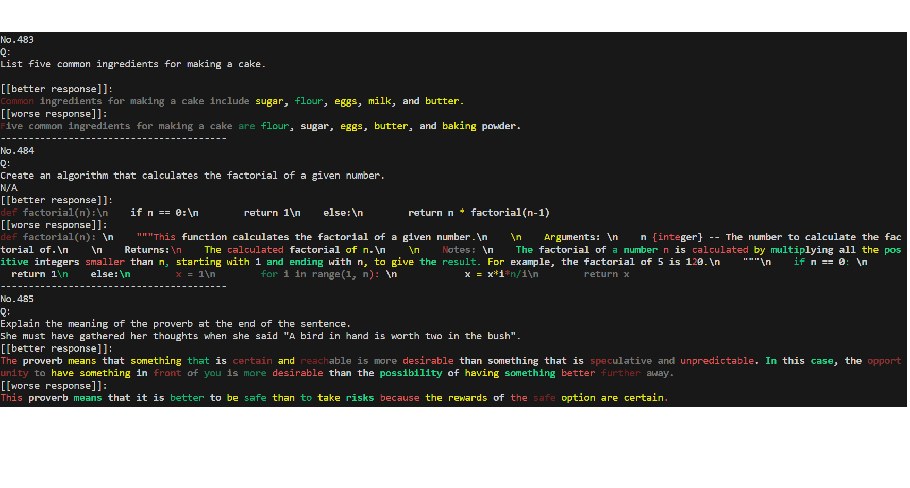

# Probe
### main.py
Call `probe_dist()` to get probabilities and ranks for the given QA-pairs. Results are saved in *qa_status*.

This project is tested on alpaca-preference dataset, so many methods are designed according to the special format of this dataset.

I plan to adjust the methods in the DistributionProbe class to abstract the processing of datasets, support streaming output, and provide overall probability distribution for individual tokens.
# Visualize
### analyze.py
Different color represents tokens with different probabilities and ranks predicted by certain model. In the default setting, darker tokens have lower ranking and vice versa. 

White, green, yellow and red represent increasingly lower predicted probabilities in turn.
`class controller` reads the file in *qa_status* and displays results in the terminal.  

